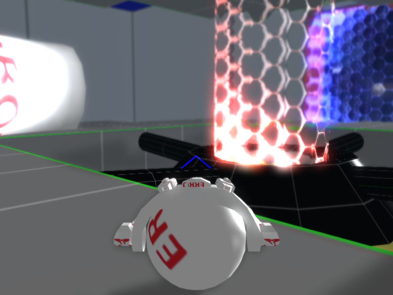

# ProjectSand
XNA game project I did independently in 2011. Contains only binaries. Everything is made from scratch, except for the physics engine JigLibX Physic Library (http://jiglibx.codeplex.com/). Despite the name, it has nothing to do with sand.

How to run:
-----------------------
1. Install XNA 4.0 (xnafx40_redist.msi)
2. Run the game (ProjectSandGame.exe)
3. Click Connect -> Connect
4. Click Host Game
5. Click Options -> Start Hosting
